Week 13 Color Palettes - looping through paletteer
================

-   [Setup and Data import](#setup-and-data-import)
    -   [libraries](#libraries)
    -   [import and look at](#import-and-look-at)
    -   [reshape](#reshape)
    -   [Bar chart with ggplot](#bar-chart-with-ggplot)
-   [Set up the graphing function](#set-up-the-graphing-function)
    -   [Pull out the data frame with package and palette names](#pull-out-the-data-frame-with-package-and-palette-names)
    -   [Make a function for plotting](#make-a-function-for-plotting)
    -   [Use purrr::map2 to loop through it](#use-purrrmap2-to-loop-through-it)

Setup and Data import
=====================

libraries
---------

``` r
# week 13

library(tidyverse)
```

    ## -- Attaching packages ------------------------------------------------ tidyverse 1.2.1 --

    ## v ggplot2 2.2.1     v purrr   0.2.5
    ## v tibble  1.4.2     v dplyr   0.7.5
    ## v tidyr   0.8.1     v stringr 1.3.1
    ## v readr   1.1.1     v forcats 0.3.0

    ## -- Conflicts --------------------------------------------------- tidyverse_conflicts() --
    ## x dplyr::filter() masks stats::filter()
    ## x dplyr::lag()    masks stats::lag()

``` r
library(skimr)
library(paletteer)
```

import and look at
------------------

``` r
dat <- read.csv("../data/week13_alcohol_global.csv")

skim(dat)
```

    ## Skim summary statistics
    ##  n obs: 193 
    ##  n variables: 5 
    ## 
    ## -- Variable type:factor -----------------------------------------------------------------
    ##  variable missing complete   n n_unique                     top_counts
    ##   country       0      193 193      193 Afg: 1, Alb: 1, Alg: 1, And: 1
    ##  ordered
    ##    FALSE
    ## 
    ## -- Variable type:integer ----------------------------------------------------------------
    ##         variable missing complete   n   mean     sd p0 p25 p50 p75 p100
    ##    beer_servings       0      193 193 106.16 101.14  0  20  76 188  376
    ##  spirit_servings       0      193 193  80.99  88.28  0   4  56 128  438
    ##    wine_servings       0      193 193  49.45  79.7   0   1   8  59  370
    ##      hist
    ##  <U+2587><U+2583><U+2582><U+2582><U+2582><U+2582><U+2581><U+2581>
    ##  <U+2587><U+2583><U+2582><U+2582><U+2581><U+2581><U+2581><U+2581>
    ##  <U+2587><U+2581><U+2581><U+2581><U+2581><U+2581><U+2581><U+2581>
    ## 
    ## -- Variable type:numeric ----------------------------------------------------------------
    ##                      variable missing complete   n mean   sd p0 p25 p50
    ##  total_litres_of_pure_alcohol       0      193 193 4.72 3.77  0 1.3 4.2
    ##  p75 p100     hist
    ##  7.2 14.4 <U+2587><U+2583><U+2583><U+2585><U+2582><U+2582><U+2582><U+2581>

``` r
head(dat)
```

    ##             country beer_servings spirit_servings wine_servings
    ## 1       Afghanistan             0               0             0
    ## 2           Albania            89             132            54
    ## 3           Algeria            25               0            14
    ## 4           Andorra           245             138           312
    ## 5            Angola           217              57            45
    ## 6 Antigua & Barbuda           102             128            45
    ##   total_litres_of_pure_alcohol
    ## 1                          0.0
    ## 2                          4.9
    ## 3                          0.7
    ## 4                         12.4
    ## 5                          5.9
    ## 6                          4.9

reshape
-------

Only select top 4 countries for easier-to-see plots

``` r
# reshape so I can group and make faceted plots
# top_n to pull out 40 countries with highest consumption
# make country a factor
# gather() to put it in long format
dat2 <- dat %>%
    rename(beer = beer_servings,
           wine = wine_servings,
           spirits = spirit_servings) %>%
    top_n(4, total_litres_of_pure_alcohol) %>%  
    mutate(country = as.factor(country)) %>%  
    gather(key = "alc_type", value = "value", 
           -country, -total_litres_of_pure_alcohol) 
```

Bar chart with ggplot
---------------------

``` r
# exploratory bar chart
p <- ggplot(dat2, aes(x = alc_type, y = value, fill = alc_type)) +
    geom_col(show.legend = FALSE) +
    facet_wrap(~country, ncol = 2) +
    theme_bw() +
    labs(x = "alcohol type", 
         y = "# servings")
```

``` r
print(p)
```


Set up the graphing function
============================

Pull out the data frame with package and palette names
------------------------------------------------------

``` r
palettes <- palettes_d_names
```

Make a function for plotting
----------------------------

``` r
plot_fun <- function(base_plot, col_pkg, col_pal) {
    Title <- paste(col_pkg, col_pal)
    out <- base_plot +
        scale_fill_paletteer_d(!!ensym(col_pkg), !!ensym(col_pal)) +
        ggtitle(Title)
    return(out)
}
```

Use purrr::map2 to loop through it
----------------------------------

``` r
# p is my base plot from up above
map2(palettes$package, palettes$palette, ~ plot_fun(p, .x, .y))
```

    ## [[1]]


    ## 
    ## [[2]]


    ## 
    ## [[3]]


    ## 
    ## [[4]]


    ## 
    ## [[5]]


    ## 
    ## [[6]]


    ## 
    ## [[7]]


    ## 
    ## [[8]]


    ## 
    ## [[9]]


    ## 
    ## [[10]]


    ## 
    ## [[11]]


    ## 
    ## [[12]]


    ## 
    ## [[13]]


    ## 
    ## [[14]]


    ## 
    ## [[15]]


    ## 
    ## [[16]]


    ## 
    ## [[17]]


    ## 
    ## [[18]]


    ## 
    ## [[19]]


    ## 
    ## [[20]]


    ## 
    ## [[21]]


    ## 
    ## [[22]]


    ## 
    ## [[23]]


    ## 
    ## [[24]]


    ## 
    ## [[25]]


    ## 
    ## [[26]]


    ## 
    ## [[27]]


    ## 
    ## [[28]]


    ## 
    ## [[29]]


    ## 
    ## [[30]]


    ## 
    ## [[31]]


    ## 
    ## [[32]]


    ## 
    ## [[33]]


    ## 
    ## [[34]]


    ## 
    ## [[35]]


    ## 
    ## [[36]]


    ## 
    ## [[37]]


    ## 
    ## [[38]]


    ## 
    ## [[39]]


    ## 
    ## [[40]]


    ## 
    ## [[41]]


    ## 
    ## [[42]]


    ## 
    ## [[43]]


    ## 
    ## [[44]]

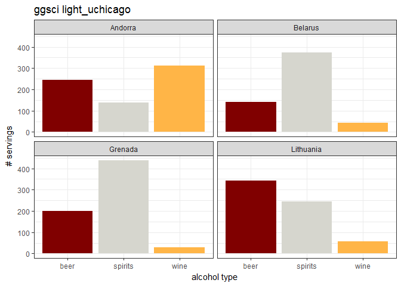

    ## 
    ## [[45]]


    ## 
    ## [[46]]


    ## 
    ## [[47]]


    ## 
    ## [[48]]


    ## 
    ## [[49]]


    ## 
    ## [[50]]


    ## 
    ## [[51]]


    ## 
    ## [[52]]


    ## 
    ## [[53]]


    ## 
    ## [[54]]


    ## 
    ## [[55]]


    ## 
    ## [[56]]


    ## 
    ## [[57]]


    ## 
    ## [[58]]


    ## 
    ## [[59]]


    ## 
    ## [[60]]


    ## 
    ## [[61]]

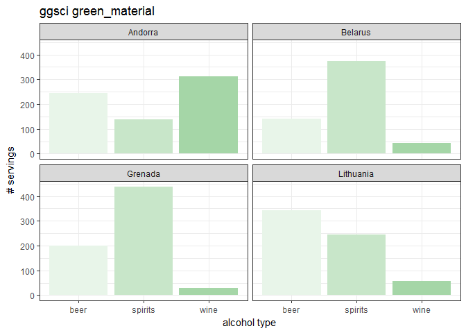

    ## 
    ## [[62]]


    ## 
    ## [[63]]


    ## 
    ## [[64]]


    ## 
    ## [[65]]


    ## 
    ## [[66]]


    ## 
    ## [[67]]


    ## 
    ## [[68]]


    ## 
    ## [[69]]


    ## 
    ## [[70]]


    ## 
    ## [[71]]


    ## 
    ## [[72]]


    ## 
    ## [[73]]


    ## 
    ## [[74]]


    ## 
    ## [[75]]


    ## 
    ## [[76]]


    ## 
    ## [[77]]


    ## 
    ## [[78]]


    ## 
    ## [[79]]


    ## 
    ## [[80]]


    ## 
    ## [[81]]


    ## 
    ## [[82]]


    ## 
    ## [[83]]


    ## 
    ## [[84]]


    ## 
    ## [[85]]


    ## 
    ## [[86]]


    ## 
    ## [[87]]


    ## 
    ## [[88]]


    ## 
    ## [[89]]


    ## 
    ## [[90]]


    ## 
    ## [[91]]

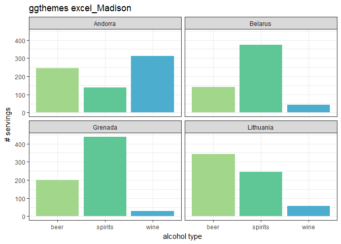

    ## 
    ## [[92]]


    ## 
    ## [[93]]


    ## 
    ## [[94]]


    ## 
    ## [[95]]


    ## 
    ## [[96]]


    ## 
    ## [[97]]


    ## 
    ## [[98]]


    ## 
    ## [[99]]


    ## 
    ## [[100]]


    ## 
    ## [[101]]


    ## 
    ## [[102]]


    ## 
    ## [[103]]


    ## 
    ## [[104]]


    ## 
    ## [[105]]


    ## 
    ## [[106]]


    ## 
    ## [[107]]


    ## 
    ## [[108]]


    ## 
    ## [[109]]


    ## 
    ## [[110]]


    ## 
    ## [[111]]


    ## 
    ## [[112]]


    ## 
    ## [[113]]


    ## 
    ## [[114]]


    ## 
    ## [[115]]


    ## 
    ## [[116]]


    ## 
    ## [[117]]


    ## 
    ## [[118]]


    ## 
    ## [[119]]


    ## 
    ## [[120]]


    ## 
    ## [[121]]


    ## 
    ## [[122]]


    ## 
    ## [[123]]


    ## 
    ## [[124]]


    ## 
    ## [[125]]


    ## 
    ## [[126]]


    ## 
    ## [[127]]


    ## 
    ## [[128]]


    ## 
    ## [[129]]


    ## 
    ## [[130]]


    ## 
    ## [[131]]


    ## 
    ## [[132]]


    ## 
    ## [[133]]


    ## 
    ## [[134]]


    ## 
    ## [[135]]


    ## 
    ## [[136]]


    ## 
    ## [[137]]


    ## 
    ## [[138]]


    ## 
    ## [[139]]


    ## 
    ## [[140]]


    ## 
    ## [[141]]


    ## 
    ## [[142]]


    ## 
    ## [[143]]


    ## 
    ## [[144]]


    ## 
    ## [[145]]


    ## 
    ## [[146]]


    ## 
    ## [[147]]


    ## 
    ## [[148]]


    ## 
    ## [[149]]


    ## 
    ## [[150]]


    ## 
    ## [[151]]


    ## 
    ## [[152]]

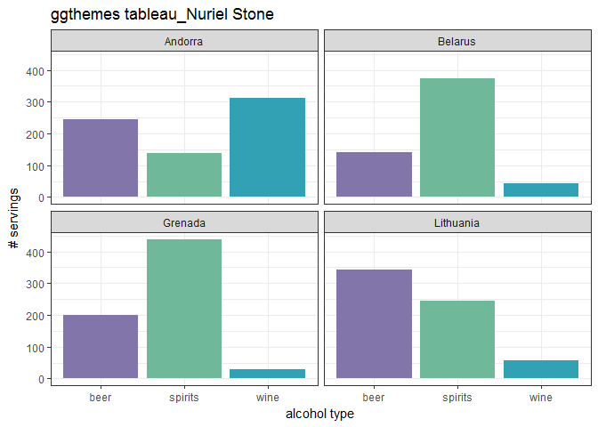

    ## 
    ## [[153]]


    ## 
    ## [[154]]


    ## 
    ## [[155]]


    ## 
    ## [[156]]


    ## 
    ## [[157]]


    ## 
    ## [[158]]


    ## 
    ## [[159]]


    ## 
    ## [[160]]


    ## 
    ## [[161]]


    ## 
    ## [[162]]


    ## 
    ## [[163]]


    ## 
    ## [[164]]


    ## 
    ## [[165]]


    ## 
    ## [[166]]


    ## 
    ## [[167]]


    ## 
    ## [[168]]


    ## 
    ## [[169]]


    ## 
    ## [[170]]


    ## 
    ## [[171]]


    ## 
    ## [[172]]


    ## 
    ## [[173]]


    ## 
    ## [[174]]


    ## 
    ## [[175]]


    ## 
    ## [[176]]


    ## 
    ## [[177]]


    ## 
    ## [[178]]


    ## 
    ## [[179]]


    ## 
    ## [[180]]


    ## 
    ## [[181]]


    ## 
    ## [[182]]


    ## 
    ## [[183]]


    ## 
    ## [[184]]


    ## 
    ## [[185]]


    ## 
    ## [[186]]


    ## 
    ## [[187]]


    ## 
    ## [[188]]


    ## 
    ## [[189]]


    ## 
    ## [[190]]


    ## 
    ## [[191]]


    ## 
    ## [[192]]


    ## 
    ## [[193]]


    ## 
    ## [[194]]


    ## 
    ## [[195]]


    ## 
    ## [[196]]


    ## 
    ## [[197]]


    ## 
    ## [[198]]


    ## 
    ## [[199]]


    ## 
    ## [[200]]


    ## 
    ## [[201]]


    ## 
    ## [[202]]


    ## 
    ## [[203]]


    ## 
    ## [[204]]


    ## 
    ## [[205]]


    ## 
    ## [[206]]


    ## 
    ## [[207]]


    ## 
    ## [[208]]

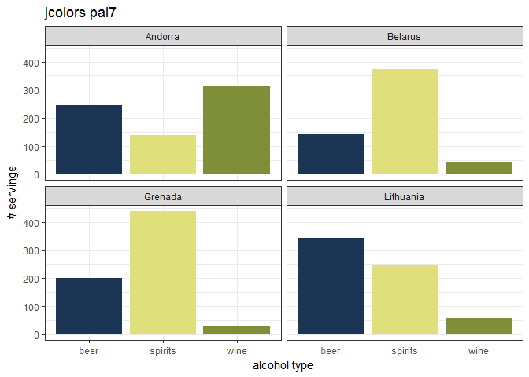

    ## 
    ## [[209]]


    ## 
    ## [[210]]


    ## 
    ## [[211]]


    ## 
    ## [[212]]


    ## 
    ## [[213]]


    ## 
    ## [[214]]


    ## 
    ## [[215]]


    ## 
    ## [[216]]


    ## 
    ## [[217]]


    ## 
    ## [[218]]


    ## 
    ## [[219]]


    ## 
    ## [[220]]


    ## 
    ## [[221]]


    ## 
    ## [[222]]


    ## 
    ## [[223]]


    ## 
    ## [[224]]


    ## 
    ## [[225]]


    ## 
    ## [[226]]


    ## 
    ## [[227]]

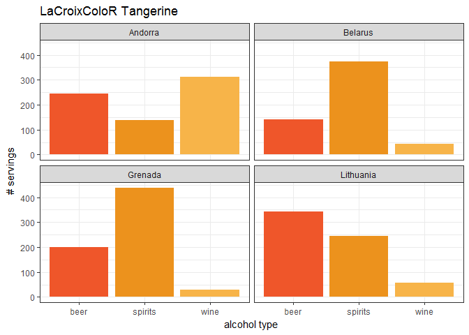

    ## 
    ## [[228]]


    ## 
    ## [[229]]


    ## 
    ## [[230]]


    ## 
    ## [[231]]


    ## 
    ## [[232]]


    ## 
    ## [[233]]


    ## 
    ## [[234]]


    ## 
    ## [[235]]


    ## 
    ## [[236]]


    ## 
    ## [[237]]


    ## 
    ## [[238]]


    ## 
    ## [[239]]


    ## 
    ## [[240]]


    ## 
    ## [[241]]


    ## 
    ## [[242]]


    ## 
    ## [[243]]


    ## 
    ## [[244]]


    ## 
    ## [[245]]

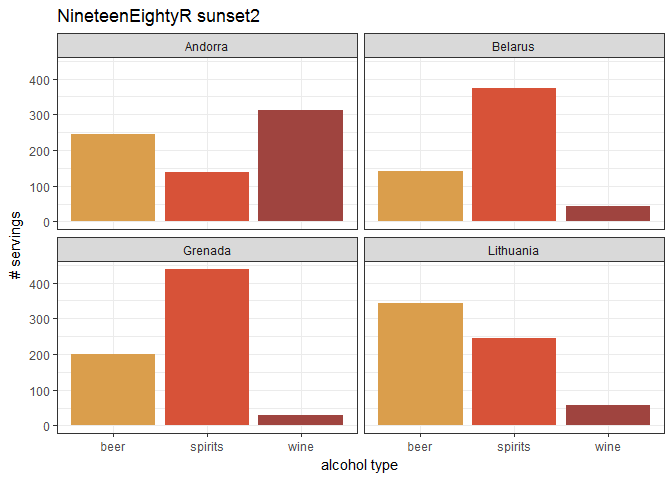

    ## 
    ## [[246]]


    ## 
    ## [[247]]


    ## 
    ## [[248]]


    ## 
    ## [[249]]


    ## 
    ## [[250]]


    ## 
    ## [[251]]


    ## 
    ## [[252]]


    ## 
    ## [[253]]

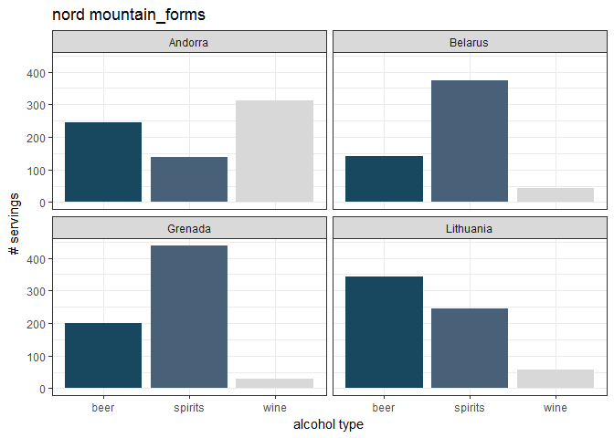

    ## 
    ## [[254]]


    ## 
    ## [[255]]


    ## 
    ## [[256]]


    ## 
    ## [[257]]


    ## 
    ## [[258]]


    ## 
    ## [[259]]


    ## 
    ## [[260]]


    ## 
    ## [[261]]


    ## 
    ## [[262]]


    ## 
    ## [[263]]


    ## 
    ## [[264]]


    ## 
    ## [[265]]


    ## 
    ## [[266]]


    ## 
    ## [[267]]


    ## 
    ## [[268]]


    ## 
    ## [[269]]


    ## 
    ## [[270]]


    ## 
    ## [[271]]


    ## 
    ## [[272]]


    ## 
    ## [[273]]


    ## 
    ## [[274]]


    ## 
    ## [[275]]


    ## 
    ## [[276]]


    ## 
    ## [[277]]


    ## 
    ## [[278]]


    ## 
    ## [[279]]


    ## 
    ## [[280]]


    ## 
    ## [[281]]


    ## 
    ## [[282]]

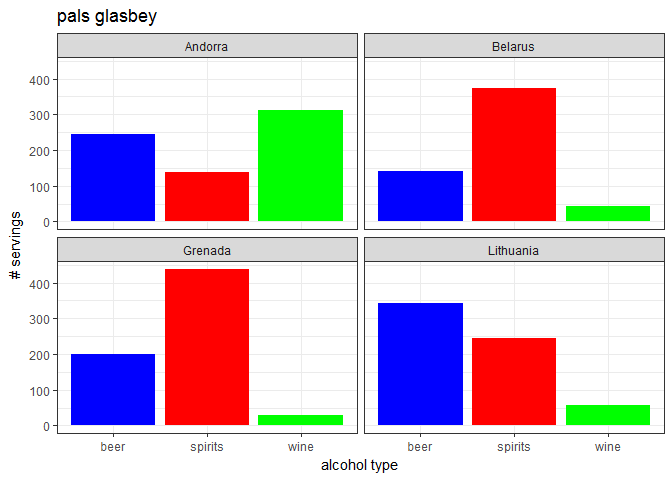

    ## 
    ## [[283]]


    ## 
    ## [[284]]


    ## 
    ## [[285]]


    ## 
    ## [[286]]


    ## 
    ## [[287]]

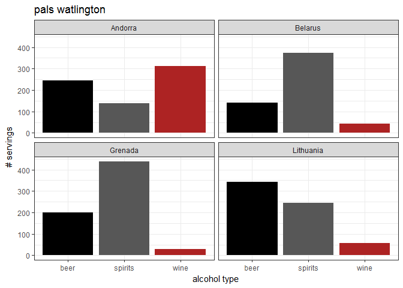

    ## 
    ## [[288]]


    ## 
    ## [[289]]


    ## 
    ## [[290]]


    ## 
    ## [[291]]


    ## 
    ## [[292]]


    ## 
    ## [[293]]


    ## 
    ## [[294]]


    ## 
    ## [[295]]


    ## 
    ## [[296]]


    ## 
    ## [[297]]

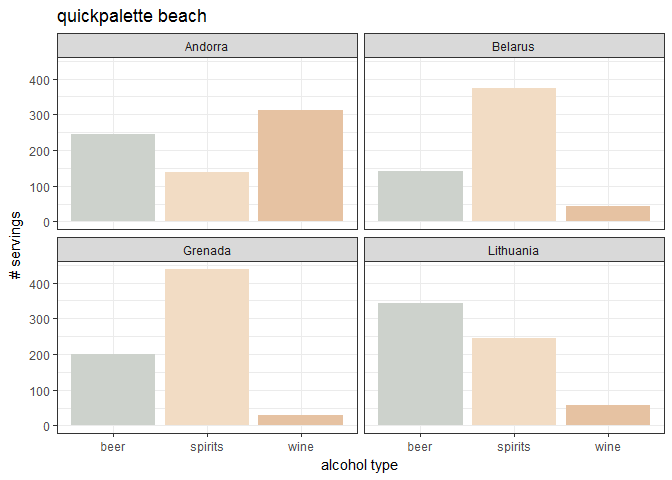

    ## 
    ## [[298]]


    ## 
    ## [[299]]


    ## 
    ## [[300]]


    ## 
    ## [[301]]


    ## 
    ## [[302]]


    ## 
    ## [[303]]


    ## 
    ## [[304]]


    ## 
    ## [[305]]


    ## 
    ## [[306]]


    ## 
    ## [[307]]


    ## 
    ## [[308]]


    ## 
    ## [[309]]


    ## 
    ## [[310]]


    ## 
    ## [[311]]


    ## 
    ## [[312]]


    ## 
    ## [[313]]


    ## 
    ## [[314]]


    ## 
    ## [[315]]


    ## 
    ## [[316]]


    ## 
    ## [[317]]


    ## 
    ## [[318]]


    ## 
    ## [[319]]


    ## 
    ## [[320]]


    ## 
    ## [[321]]


    ## 
    ## [[322]]


    ## 
    ## [[323]]


    ## 
    ## [[324]]


    ## 
    ## [[325]]


    ## 
    ## [[326]]


    ## 
    ## [[327]]


    ## 
    ## [[328]]


    ## 
    ## [[329]]


    ## 
    ## [[330]]


    ## 
    ## [[331]]


    ## 
    ## [[332]]


    ## 
    ## [[333]]


    ## 
    ## [[334]]


    ## 
    ## [[335]]


    ## 
    ## [[336]]


    ## 
    ## [[337]]


    ## 
    ## [[338]]

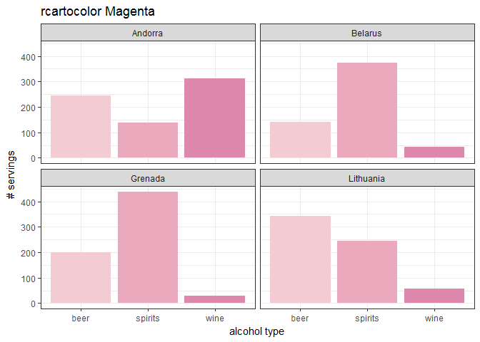

    ## 
    ## [[339]]


    ## 
    ## [[340]]


    ## 
    ## [[341]]


    ## 
    ## [[342]]


    ## 
    ## [[343]]


    ## 
    ## [[344]]


    ## 
    ## [[345]]


    ## 
    ## [[346]]

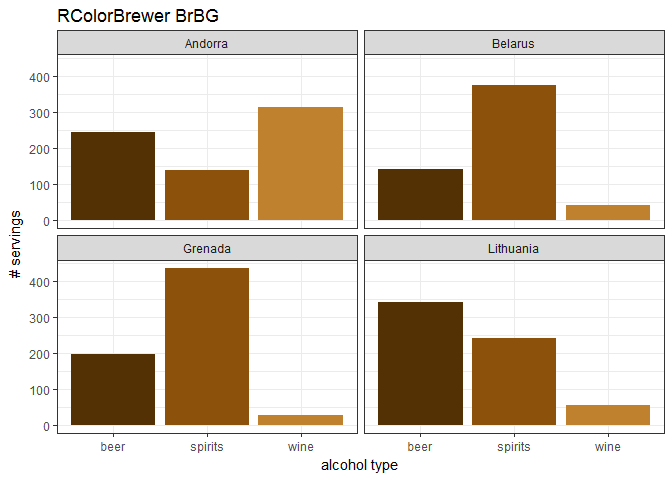

    ## 
    ## [[347]]


    ## 
    ## [[348]]


    ## 
    ## [[349]]


    ## 
    ## [[350]]


    ## 
    ## [[351]]


    ## 
    ## [[352]]


    ## 
    ## [[353]]


    ## 
    ## [[354]]


    ## 
    ## [[355]]


    ## 
    ## [[356]]


    ## 
    ## [[357]]


    ## 
    ## [[358]]


    ## 
    ## [[359]]


    ## 
    ## [[360]]


    ## 
    ## [[361]]


    ## 
    ## [[362]]


    ## 
    ## [[363]]


    ## 
    ## [[364]]


    ## 
    ## [[365]]


    ## 
    ## [[366]]


    ## 
    ## [[367]]


    ## 
    ## [[368]]

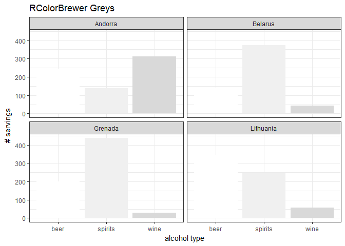

    ## 
    ## [[369]]


    ## 
    ## [[370]]


    ## 
    ## [[371]]


    ## 
    ## [[372]]


    ## 
    ## [[373]]


    ## 
    ## [[374]]


    ## 
    ## [[375]]


    ## 
    ## [[376]]


    ## 
    ## [[377]]


    ## 
    ## [[378]]


    ## 
    ## [[379]]

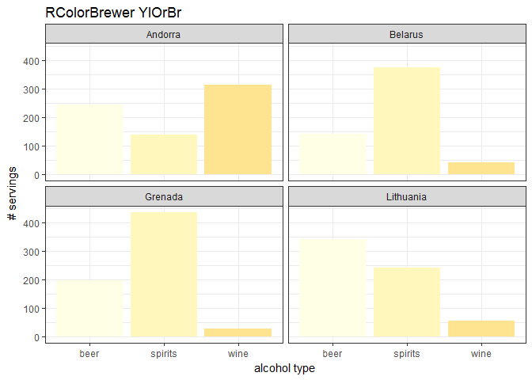

    ## 
    ## [[380]]


    ## 
    ## [[381]]


    ## 
    ## [[382]]


    ## 
    ## [[383]]


    ## 
    ## [[384]]


    ## 
    ## [[385]]


    ## 
    ## [[386]]


    ## 
    ## [[387]]


    ## 
    ## [[388]]


    ## 
    ## [[389]]


    ## 
    ## [[390]]


    ## 
    ## [[391]]


    ## 
    ## [[392]]


    ## 
    ## [[393]]


    ## 
    ## [[394]]


    ## 
    ## [[395]]


    ## 
    ## [[396]]


    ## 
    ## [[397]]


    ## 
    ## [[398]]


    ## 
    ## [[399]]


    ## 
    ## [[400]]


    ## 
    ## [[401]]


    ## 
    ## [[402]]


    ## 
    ## [[403]]


    ## 
    ## [[404]]


    ## 
    ## [[405]]


    ## 
    ## [[406]]


    ## 
    ## [[407]]


    ## 
    ## [[408]]


    ## 
    ## [[409]]

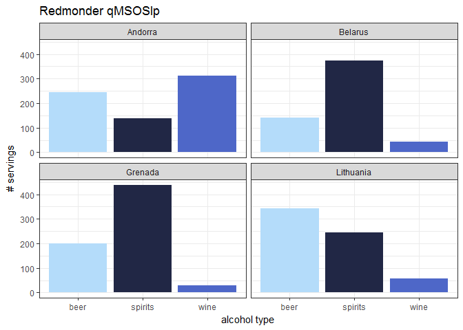

    ## 
    ## [[410]]


    ## 
    ## [[411]]


    ## 
    ## [[412]]


    ## 
    ## [[413]]


    ## 
    ## [[414]]


    ## 
    ## [[415]]


    ## 
    ## [[416]]


    ## 
    ## [[417]]


    ## 
    ## [[418]]


    ## 
    ## [[419]]


    ## 
    ## [[420]]


    ## 
    ## [[421]]


    ## 
    ## [[422]]


    ## 
    ## [[423]]


    ## 
    ## [[424]]


    ## 
    ## [[425]]


    ## 
    ## [[426]]


    ## 
    ## [[427]]


    ## 
    ## [[428]]


    ## 
    ## [[429]]


    ## 
    ## [[430]]


    ## 
    ## [[431]]


    ## 
    ## [[432]]

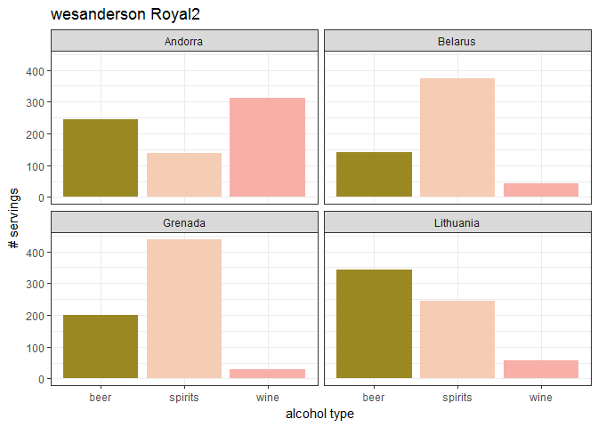

    ## 
    ## [[433]]


    ## 
    ## [[434]]


    ## 
    ## [[435]]


    ## 
    ## [[436]]


    ## 
    ## [[437]]


    ## 
    ## [[438]]


    ## 
    ## [[439]]


    ## 
    ## [[440]]


    ## 
    ## [[441]]


    ## 
    ## [[442]]


    ## 
    ## [[443]]


    ## 
    ## [[444]]


    ## 
    ## [[445]]


    ## 
    ## [[446]]


    ## 
    ## [[447]]


    ## 
    ## [[448]]


    ## 
    ## [[449]]


    ## 
    ## [[450]]


    ## 
    ## [[451]]


    ## 
    ## [[452]]


    ## 
    ## [[453]]


    ## 
    ## [[454]]


    ## 
    ## [[455]]


    ## 
    ## [[456]]


    ## 
    ## [[457]]


    ## 
    ## [[458]]


    ## 
    ## [[459]]


    ## 
    ## [[460]]


    ## 
    ## [[461]]


    ## 
    ## [[462]]


    ## 
    ## [[463]]


    ## 
    ## [[464]]


    ## 
    ## [[465]]


    ## 
    ## [[466]]


