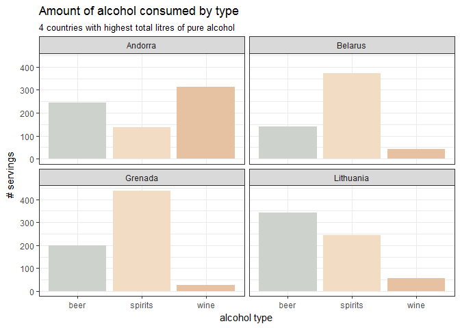

Tidy Tuesday Week 13
================

-   [Setup and Data import](#setup-and-data-import)
    -   [libraries](#libraries)
    -   [import and look at](#import-and-look-at)
    -   [reshape](#reshape)
-   [Plotting](#plotting)
    -   [Scatterplot Matrix](#scatterplot-matrix)
    -   [Bar chart with ggplot](#bar-chart-with-ggplot)
        -   [RColorBrewer](#rcolorbrewer)
        -   [Paletteer package](#paletteer-package)

Mostly playing with color palettes here.

Setup and Data import
=====================

libraries
---------

``` r
# week 13

library(tidyverse)
```

    ## -- Attaching packages ------------------------------------------------ tidyverse 1.2.1 --

    ## v ggplot2 2.2.1     v purrr   0.2.5
    ## v tibble  1.4.2     v dplyr   0.7.5
    ## v tidyr   0.8.1     v stringr 1.3.1
    ## v readr   1.1.1     v forcats 0.3.0

    ## -- Conflicts --------------------------------------------------- tidyverse_conflicts() --
    ## x dplyr::filter() masks stats::filter()
    ## x dplyr::lag()    masks stats::lag()

``` r
library(skimr)
library(paletteer)
```

import and look at
------------------

``` r
dat <- read.csv("../data/week13_alcohol_global.csv")

skim(dat)
```

    ## Skim summary statistics
    ##  n obs: 193 
    ##  n variables: 5 
    ## 
    ## -- Variable type:factor -----------------------------------------------------------------
    ##  variable missing complete   n n_unique                     top_counts
    ##   country       0      193 193      193 Afg: 1, Alb: 1, Alg: 1, And: 1
    ##  ordered
    ##    FALSE
    ## 
    ## -- Variable type:integer ----------------------------------------------------------------
    ##         variable missing complete   n   mean     sd p0 p25 p50 p75 p100
    ##    beer_servings       0      193 193 106.16 101.14  0  20  76 188  376
    ##  spirit_servings       0      193 193  80.99  88.28  0   4  56 128  438
    ##    wine_servings       0      193 193  49.45  79.7   0   1   8  59  370
    ##      hist
    ##  <U+2587><U+2583><U+2582><U+2582><U+2582><U+2582><U+2581><U+2581>
    ##  <U+2587><U+2583><U+2582><U+2582><U+2581><U+2581><U+2581><U+2581>
    ##  <U+2587><U+2581><U+2581><U+2581><U+2581><U+2581><U+2581><U+2581>
    ## 
    ## -- Variable type:numeric ----------------------------------------------------------------
    ##                      variable missing complete   n mean   sd p0 p25 p50
    ##  total_litres_of_pure_alcohol       0      193 193 4.72 3.77  0 1.3 4.2
    ##  p75 p100     hist
    ##  7.2 14.4 <U+2587><U+2583><U+2583><U+2585><U+2582><U+2582><U+2582><U+2581>

``` r
head(dat)
```

    ##             country beer_servings spirit_servings wine_servings
    ## 1       Afghanistan             0               0             0
    ## 2           Albania            89             132            54
    ## 3           Algeria            25               0            14
    ## 4           Andorra           245             138           312
    ## 5            Angola           217              57            45
    ## 6 Antigua & Barbuda           102             128            45
    ##   total_litres_of_pure_alcohol
    ## 1                          0.0
    ## 2                          4.9
    ## 3                          0.7
    ## 4                         12.4
    ## 5                          5.9
    ## 6                          4.9

reshape
-------

Only select top 4 countries for easier-to-see plots

``` r
# reshape so I can group and make faceted plots
# top_n to pull out 40 countries with highest consumption
# make country a factor
# gather() to put it in long format
dat2 <- dat %>%
    rename(beer = beer_servings,
           wine = wine_servings,
           spirits = spirit_servings) %>%
    top_n(4, total_litres_of_pure_alcohol) %>%  
    mutate(country = as.factor(country)) %>%  
    gather(key = "alc_type", value = "value", 
           -country, -total_litres_of_pure_alcohol) 
```

Plotting
========

Scatterplot Matrix
------------------

``` r
# scatterplot matrix
# (everything against everything else)
plot(dat, main = "Scatterplot Matrix")
```


Bar chart with ggplot
---------------------

``` r
# exploratory bar chart
p <- ggplot(dat2, aes(x = alc_type, y = value, fill = alc_type)) +
    geom_col(show.legend = FALSE) +
    facet_wrap(~country, ncol = 2) +
    theme_bw() +
    labs(title = "Amount of alcohol consumed by type", 
         subtitle = "4 countries with highest total litres of pure alcohol", 
         x = "alcohol type", 
         y = "# servings")
```

### RColorBrewer

scale\_fill\_brewer from Paired palette

``` r
p + scale_fill_brewer(type = "qual", palette = "Paired")
```


Dark2 palette

``` r
p + scale_fill_brewer(type = "qual", palette = "Dark2")
```


### Paletteer package

#### Discrete, non-dynamic palettes

Nord aurora

``` r
p + scale_fill_paletteer_d(nord, aurora)
```


Nord polarnight

``` r
p + scale_fill_paletteer_d(nord, polarnight)
```


Nord snowstorm

``` r
p + scale_fill_paletteer_d(nord, snowstorm)
```


quickpalette beach

``` r
p + scale_fill_paletteer_d(quickpalette, beach)
```



quickpalette waterfall

``` r
p + scale_fill_paletteer_d(quickpalette, waterfall)
```


quickpalette sunset

``` r
p + scale_fill_paletteer_d(quickpalette, sunset)
```


rcartocolor ag\_Sunset

``` r
p + scale_fill_paletteer_d(rcartocolor, ag_Sunset)
```


rcartocolor TealRose

``` r
p + scale_fill_paletteer_d(rcartocolor, TealRose)
```


rcartocolor TealGrn

``` r
p + scale_fill_paletteer_d(rcartocolor, TealGrn)
```


rcartocolor Geyser

``` r
p + scale_fill_paletteer_d(rcartocolor, Geyser)
```


